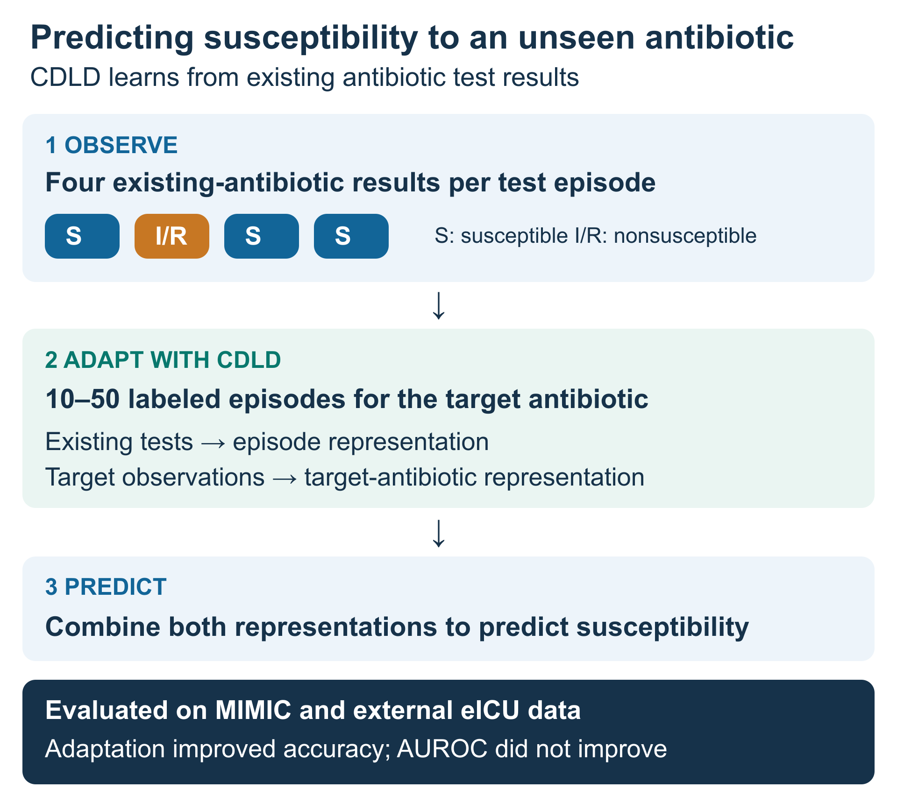

# CDLD AST reproduction



Reproduce the evaluation of antibiotics excluded from pretraining using four observed AST results per episode. The compared methods are CDLD, matrix factorization, L2 logistic regression, random forest, XGBoost, support frequency and the mean of the four observed AST values.

항생제 감수성 검사(AST)는 배양된 균의 항생제 감수성을 확인하는 검사입니다. 한 검사 사례(episode)는 한 환자의 검체에서 특정 균이 분리된 배양 검사 단위이며, 같은 환자에게 여러 사례가 있을 수 있습니다. 각 사례의 기존 항생제 검사 결과 네 개와 목표 항생제의 소수 관측을 이용해, 사전학습에 없던 목표 항생제의 감수성을 예측합니다.

## Environment / 실행 환경

Use Linux CPU with Python 3.11. Install the exact package versions in `requirements.txt`:

```sh
python -m pip install -r requirements.txt
```

Both notebooks must use this directory as their working directory. `config/` contains the selected model settings, evaluation combinations, seeds and adaptation budgets.

두 노트북의 작업 디렉터리를 이 폴더로 설정합니다. `config/`에는 재현에 필요한 고정 설정만 포함합니다.

## Data / 원자료

Credentialed users must obtain access to the restricted PhysioNet datasets and accept their data use agreements. Download only these six files and put them in one directory, retaining their basenames:

- [MIMIC-IV 3.1](https://physionet.org/content/mimiciv/3.1/): `hosp/microbiologyevents.csv.gz`, `hosp/patients.csv.gz`, `hosp/admissions.csv.gz`, `icu/icustays.csv.gz`.
- [eICU-CRD 2.0](https://physionet.org/content/eicu-crd/2.0/): `microLab.csv.gz`, `patient.csv.gz`.

Set `CDLD_RAW_DIR` to that directory. The default is `~/Downloads`. MIMIC `patients.csv.gz` and eICU `patient.csv.gz` are different files.

이용 자격과 자료 이용 계약을 갖춘 사용자가 위 여섯 파일을 직접 준비합니다. 전체 데이터셋 다운로드는 필요하지 않습니다.

## Execution / 실행 순서

1. `01_inputs.ipynb`: build cohorts, patient splits, target-drug exclusions, four-AST arrays, nested supports, classifier features and separate query labels.
2. `02_models.ipynb`: train and evaluate the selected methods. Set `CDLD_WORKERS` for CPU parallelism; the default is one worker. Each worker uses one compute thread and requires its own memory.

원자료 → 입력 → 모델 학습·적응 → 성능 평가 순서로 실행합니다. 학습 seed는 965136·110623·615357이며, 각 조합에서 support 0·10·20·30·40·50과 열 번의 중첩 반복을 사용합니다. Support 0은 목표약 latent 업데이트가 없는 조건입니다.

`CDLD_OUTPUT_DIR` sets the output directory, which must be outside this code folder. The default is `~/CDLD_AST_outputs`. Use the same output directory for both notebooks. Intermediate source modules, patient-derived inputs, models, predictions, progress files, evaluation metrics are generated there.

`CDLD_OUTPUT_DIR`를 두 노트북에서 동일하게 사용합니다. 생성물은 코드 폴더 밖에 저장합니다. 원자료·환자별 파생자료·실행 로그·저장 성능 수치·그림·노트북 출력은 배포본에 포함하지 않습니다. 노트북 실행 결과에서 환자별 자료가 포함될 수 있으므로 생성된 출력 폴더를 공개 저장소에 추가하지 마십시오.

## Evaluation rules / 평가 규칙

Patients remain in one split. The target antibiotic and three development antibiotics are excluded from pretraining. Four existing AST observations are chosen for each episode. The support sizes use prefixes of a common deterministic ordering. The fixed hash strings in the preprocessing code are part of these reproducible rules.

MIMIC target supports determine the target latent or classifier. External eICU target labels are used only for scoring. For the susceptibility-positive manuscript metrics, predictions of at least 0.5 are positive. Results are averaged within each combination over seeds and repeats, then across combinations with equal weights. Single-class query combinations have undefined AUROC.

The trainable target-drug latent and the fixed case latents are distinct. eICU case latents use the locally observed existing-drug AST, while the target latent is inherited from MIMIC support adaptation.

The AST mean is evaluated once per combination, without support or seed replication. Reported metrics are AUROC, accuracy, susceptibility sensitivity, susceptibility F1 and specificity (I/R recall). Scores of exactly 0.5 are classified as susceptible. AUROC and specificity are undefined for all-susceptible query combinations; undefined values are excluded from the corresponding means. `ast_combination.json`, `ast_summary.json` and metric-count outputs are generated alongside model metrics.
